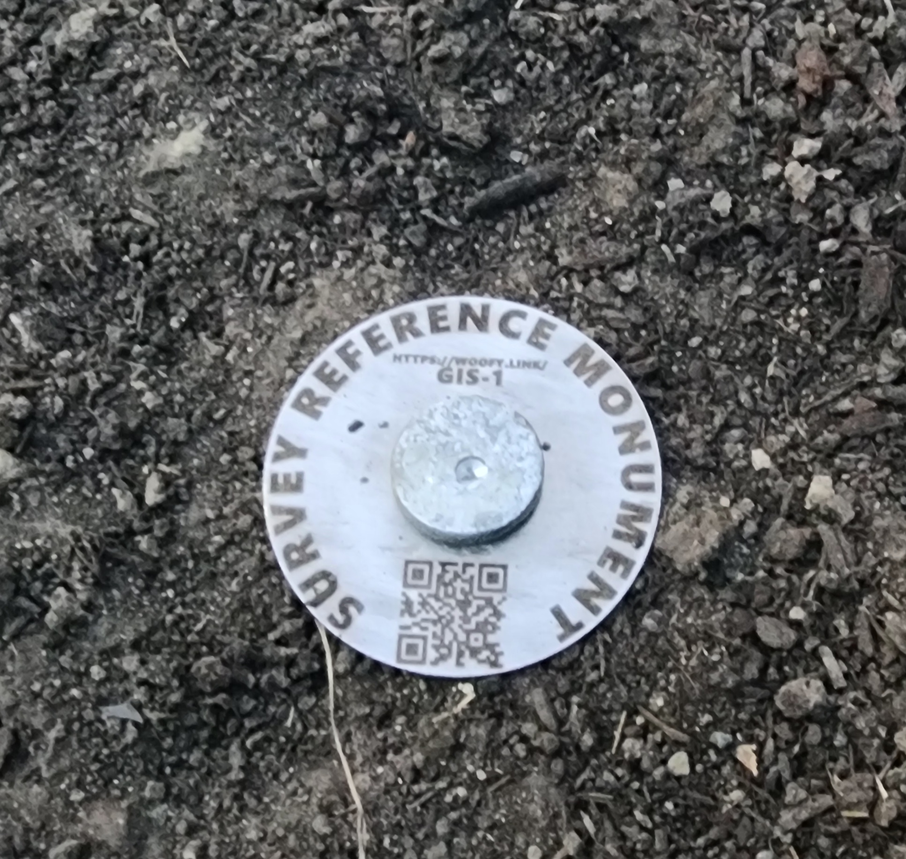
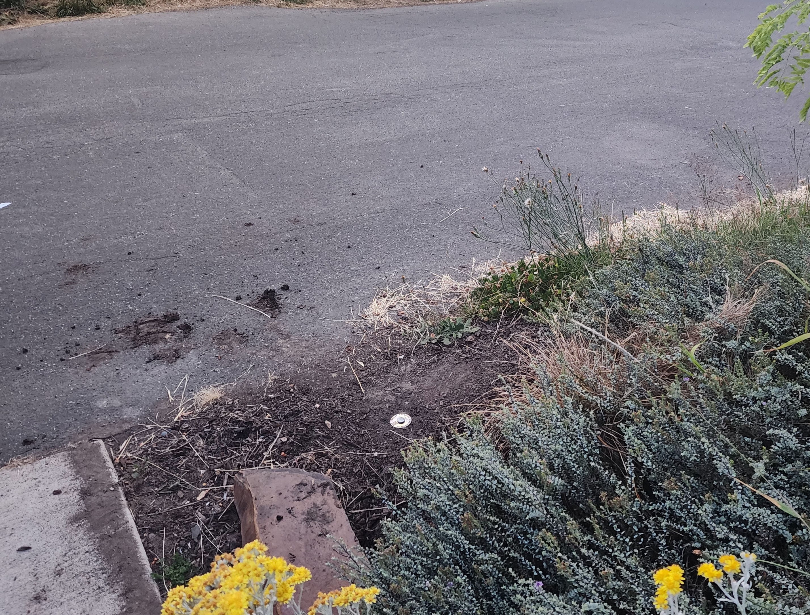

# GIS-1
## Description
2" disk with 12" stake in Right of Way, near 1814 16th Ave S, Seattle, WA, 98144
## Photos

## Most Current Obs
[OBS](rinex_SFE_Facet_LBand_230714_162930)
## Location
[OPUS Details](OPUS.txt)

REF FRAME: NAD_83(2011)(EPOCH:2010.0000)              ITRF2014 (EPOCH:2023.5340)
      
         X:     -2303718.465(m)   0.008(m)          -2303719.436(m)   0.008(m)
         Y:     -3642431.140(m)   0.018(m)          -3642429.957(m)   0.018(m)
         Z:      4686036.638(m)   0.016(m)           4686036.628(m)   0.016(m)

       LAT:   47 35 11.64847      0.016(m)        47 35 11.65974      0.016(m)
     E LON:  237 41 16.75154      0.013(m)       237 41 16.68203      0.013(m)
     W LON:  122 18 43.24846      0.013(m)       122 18 43.31797      0.013(m)
    EL HGT:           56.602(m)   0.016(m)                56.271(m)   0.016(m)
 ORTHO HGT:           80.236(m)   0.048(m) [NAVD88 (Computed using GEOID18)]

                        UTM COORDINATES    STATE PLANE COORDINATES
                         UTM (Zone 10)         SPC (4601 WA N)
Northing (Y) [meters]     5270580.051            66284.460
Easting (X)  [meters]      551729.282           388782.743
Convergence  [degrees]     0.50795000          -1.10090833
Point Scale                0.99963288           0.99998498
Combined Factor            0.99962401           0.99997611