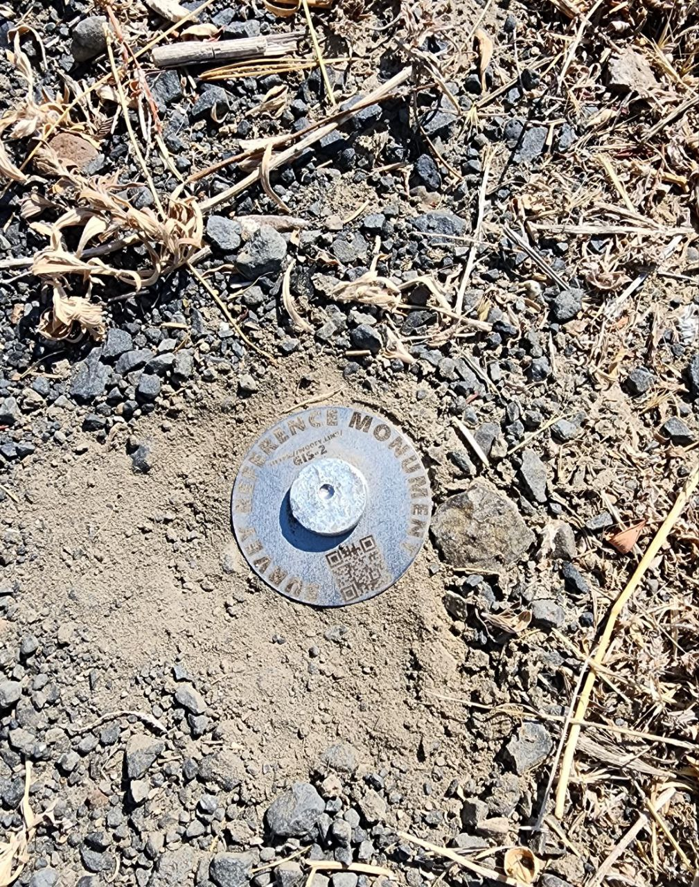
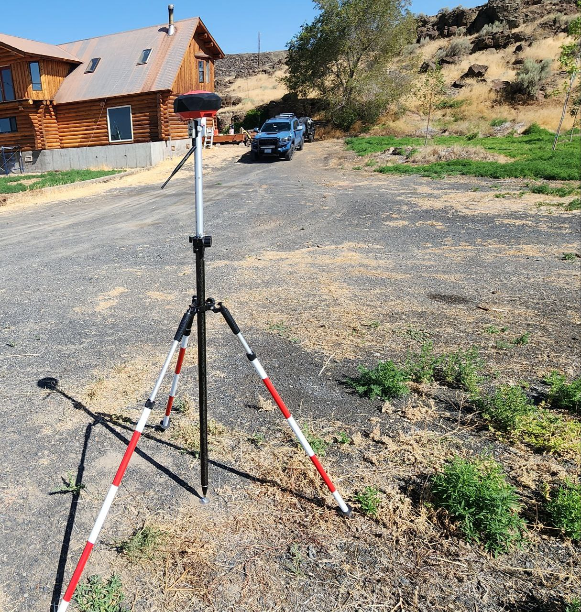

# GIS-1
## Description
2" disk with 12" stake at end of driveway near house of 4301 Martin Rd, Ephrata, WA, 98823
## Photos


## Most Current Obs
[OBS](rinex_SFE_Facet_230721_173306)
## Location
[OPUS Details](OPUS.txt)
```
 REF FRAME: NAD_83(2011)(EPOCH:2010.0000)              ITRF2014 (EPOCH:2023.5530)
      
         X:     -2140395.052(m)   0.005(m)          -2140396.061(m)   0.005(m)
         Y:     -3770128.724(m)   0.010(m)          -3770127.526(m)   0.010(m)
         Z:      4663016.882(m)   0.014(m)           4663016.842(m)   0.014(m)

       LAT:   47 16 38.56523      0.011(m)        47 16 38.57725      0.011(m)
     E LON:  240 24 55.27436      0.005(m)       240 24 55.20449      0.005(m)
     W LON:  119 35  4.72564      0.005(m)       119 35  4.79551      0.005(m)
    EL HGT:          375.453(m)   0.014(m)               375.055(m)   0.014(m)
 ORTHO HGT:          395.859(m)   0.054(m) [NAVD88 (Computed using GEOID18)]

                        UTM COORDINATES    STATE PLANE COORDINATES
                         UTM (Zone 11)         SPC (4602 WA S)
Northing (Y) [meters]     5239229.119           216491.088
Easting (X)  [meters]      304525.250           569254.638
Convergence  [degrees]    -1.89940000           0.66490833
Point Scale                1.00006962           0.99998768
Combined Factor            1.00001077           0.99992883

US NATIONAL GRID DESIGNATOR: 11TLN0452539229(NAD 83)

```